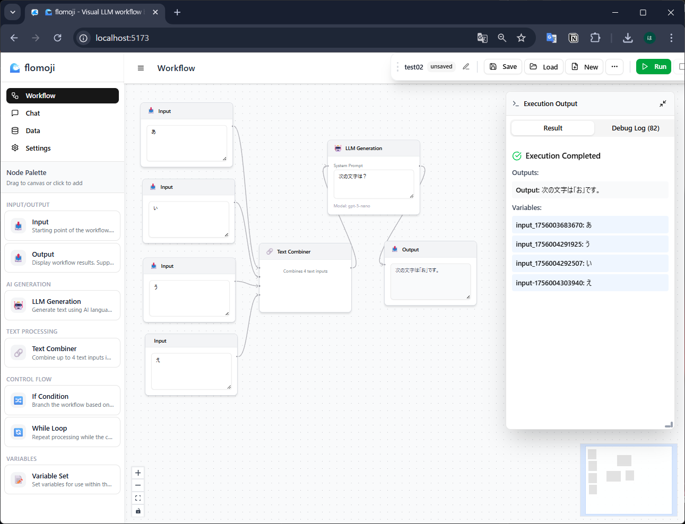

# 🌊 flomoji

**Visual LLM workflow builder for everyone**

flomoji enables AI conversations and workflow automation without complex setup. Supporting various AI providers including OpenAI, Anthropic, and local LLMs, it streamlines your work through prompt chaining and multi-step processing.

**ブラウザ（とAPIキー）だけで動く、軽量LLMエージェント開発ツール**

flomojiは、複雑な環境構築なしにAIとの対話やワークフロー自動化を実現する軽量ツールです。 OpenAI、Anthropic、ローカルLLMなど様々なAIプロバイダーに対応し、プロンプトチェーンによる多段階処理で作業を効率化できます。

## ✨ Features (特徴)

- 🚀 **Browser-only**: No installation required, runs directly in your browser.
- 💬 **AI Chat**: Real-time conversations with AI, with chat history management.
- 🔗 **Workflows**: Automate tasks using prompt chaining.
- ⚙️ **JavaScript Code Execution**: Secure in-browser JavaScript processing with Web Worker isolation and built-in templates.
- 🌐 **Web Integration**: HTTP requests, web search, and Web API connector for dynamic data processing.
- ⏰ **Scheduled Workflows**: Automate workflows with cron-based scheduling.
- 🎨 **Enhanced Node UI**: Color-coded handles and toggleable labels for better visual clarity.
- 🔌 **Multi-LLM Support**: Works with OpenAI, Anthropic, and local LLMs.
- 📊 **Data Management**: Easily manage and export your data.

## 📸 Screenshots



*Visual workflow builder with node-based interface for creating AI-powered automation workflows.*

## 🚀 Quick Start (利用方法)

### 🌐 Try Online (オンラインで試す)
**Instant access**: [**👉 Launch flomoji**](https://hama-jp.github.io/flomoji/) - No download required!

### 📥 Download for Offline Use
The easiest way to use flomoji locally is directly in your browser without any setup.

1.  **Download**: [Click here to download the latest version.](https://github.com/hama-jp/flomoji/archive/refs/heads/gh-pages.zip)
2.  **Unzip**: Extract the downloaded ZIP file.
3.  **Open**: Open the `index.html` file in your web browser (like Chrome, Firefox, or Edge).

That's it! You can start using the application immediately.

## 📝 How to Use (主な機能)

### Core Features
- **Settings (設定)**: Choose your LLM provider (like OpenAI) and enter your API key or endpoint. Test the connection to make sure it's working.
- **Chat (チャット)**: Start a conversation with the AI. Your chat history is saved automatically.
- **Workflow (ワークフロー)**: Define a series of prompts to automate a complex task. Input your data, select a workflow, and run it.
- **Data (データ)**: View, export, or back up your conversation history and other data.

### Advanced Node Types
- **⚙️ JavaScript Code Execution**: Process data with custom JavaScript code in a secure sandboxed environment
  - Built-in templates for JSON filtering, text processing, data aggregation
  - Web Worker isolation for security and performance
  - 5-second timeout protection and memory limits
- **🌐 Web Integration Nodes**:
  - HTTP Request Node: Make API calls with customizable headers and methods
  - Web Search Node: Search Google, Brave, or Bing directly from your workflows
- **🔄 Control Flow**: If/While conditions, variable management, and scheduled execution
- **📄 Structured Data Extraction**: Extract and validate JSON-schema compliant data from unstructured text
  - Rule-based extraction with regex patterns
  - LLM-based extraction with automatic prompt generation
  - Schema validation and automatic data repair

### Structured Extraction Workflow Example

The Structured Extraction feature uses a two-node pattern to extract and validate data:

```
┌──────────────┐     ┌─────────┐     ┌──────────────────┐     ┌────────────┐
│ Input Node   │────▶│Structured│────▶│   LLM Node      │────▶│   Schema   │
│ (Text Data)  │     │Extraction│     │ (Process Prompt)│     │ Validator  │
└──────────────┘     └─────────┘     └──────────────────┘     └────────────┘
                           │                                          │
                           ▼                                          ▼
                     (Direct output                            (Validated JSON)
                      if rules match)
```

**How it works:**
1. **Structured Extraction Node** attempts rule-based extraction first
2. If rules fail or in LLM mode, it generates a prompt for the LLM
3. **LLM Node** processes the prompt and returns JSON
4. **Schema Validator Node** validates and optionally repairs the JSON

This DAG-compliant pattern ensures clean data flow without cycles. See [Structured Extraction Guide](docs/STRUCTURED_EXTRACTION_GUIDE.md) for detailed documentation.

## 🧑‍💻 For Developers (開発者向け)

If you want to run the app locally or contribute to development:

**Run locally:**
```bash
# Install dependencies
pnpm install

# Start the development server
pnpm run dev
```
Then, open `http://localhost:5173` in your browser.

**Build for production:**
```bash
# Create a production build
pnpm run build
```
The output files will be in the `dist` folder. You can deploy this folder to any static hosting service.

## 🚀 CI/CD Automation

This repository includes automated CI/CD workflows using GitHub Actions:

### Pull Request Workflow
- **Quality Checks**: Automatic linting, testing, and building on every PR
- **Auto Review**: Comments with quality check results
- **Auto Merge**: Approved PRs are automatically merged after passing all checks

### Deployment Workflow  
- **Automatic Deployment**: Every merge to `main` triggers automatic deployment to GitHub Pages
- **Build & Test**: Ensures all tests pass before deployment
- **Live Updates**: Changes are automatically reflected at [https://hama-jp.github.io/flomoji/](https://hama-jp.github.io/flomoji/)

### Contributing
1. Create a feature branch from `main`
2. Make your changes and commit
3. Create a Pull Request
4. The CI system will automatically run quality checks
5. Once approved, the PR will be auto-merged and deployed

## 🔐 Security (セキュリティ)

- Your API keys are stored only in your browser's LocalStorage.
- All data processing happens on the client-side (in your browser).
- No data is ever sent to or stored on a server.
- JavaScript code execution is sandboxed using Web Workers with restricted global access.
- Timeout protection prevents infinite loops and resource exhaustion.

## 📄 License (ライセンス)

This project is licensed under the Apache 2.0 License.

## ❤️ Support (サポート)

If you have any issues or feature requests, please open an issue on GitHub.
